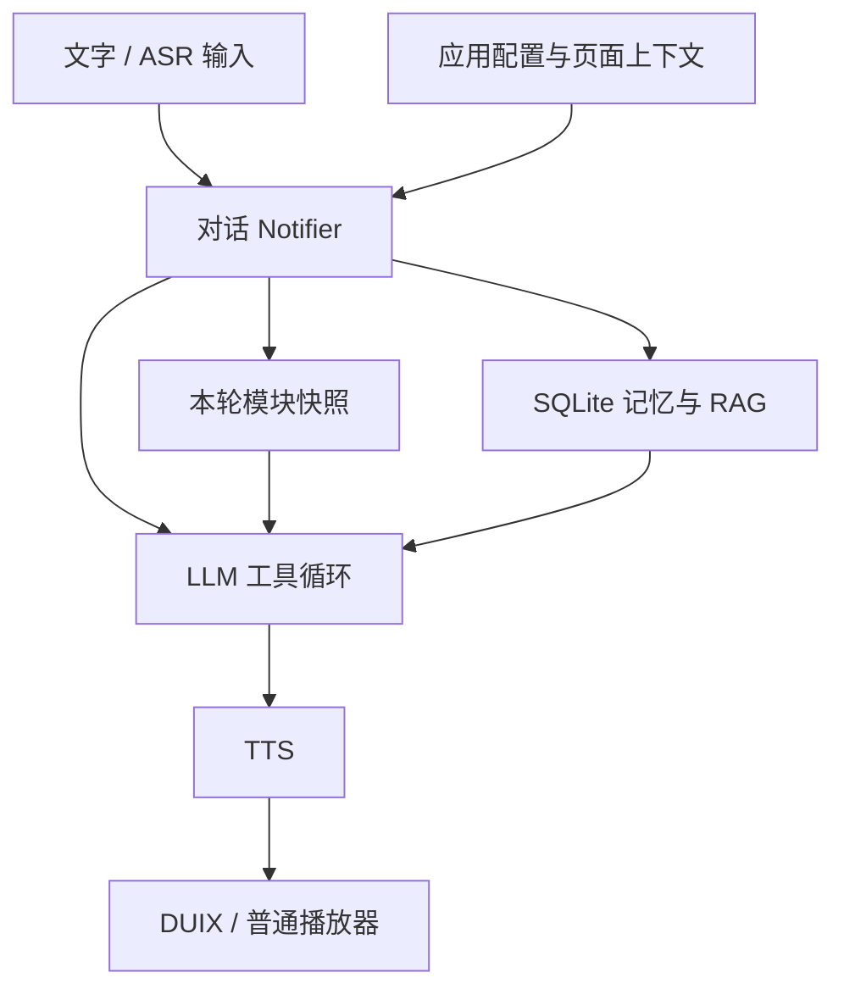

# 数字人底座说明

> 更新于 2026-10-05。底座最初从源项目 `1.0.15+16` 提取，本说明包含本次应用/上下文契约和一致性修复。公开仓库不含健康版模块或第三方模型资源。接口逐项见[接口说明书](FOUNDATION_INTERFACES.zh-CN.md)，本次实现范围与验证见[优化状态](FOUNDATION_OPTIMIZATION_STATUS.zh-CN.md)。

## 1. 定位与边界

数字人底座负责数字人显示、语音输入、模型对话、语音播报、会话与记忆、通用设置和可选工具调度。健康助手是在同一源码上编译的另一个应用版本，额外装配健身模块和界面。新项目可复用底座，再装配学习等领域模块；目前采用**编译期组合**，并非在已安装 APK 中动态加载插件。

| 项目 | 底座版 | 健康版 |
| --- | --- | --- |
| 入口 | [`lib/main_foundation.dart`](../lib/main_foundation.dart) | 原工程 `lib/main.dart`，公开副本不含 |
| Android 包名 | `com.namson.ai_secretary.foundation` | `com.namson.ai_secretary` |
| 首页/设置 | 数字人首页 + 基础设置 | 数字人首页 + 健康应用界面 |
| 通用工具 | 按需选择 WebSearch | WebSearch + 按需选择健身工具 |
| 训练资源 | 不打包动作媒体 | 打包动作目录及媒体 |
| 本地数据 | 独立应用私有 SQLite/偏好 | 独立应用私有 SQLite/偏好 |

两版虽共用数据库代码，但安装后数据不自动共享。底座仍使用 `ai_secretary.db`、schema 6 和原有表，`MemoryService` 也保留健康兼容代码。本次新增的 `AppProfile` 用于模块允许列表和页面上下文归属校验，不能替代 Android 包的存储边界、领域数据库或数据迁移。

## 2. 当前架构



[`ChatNotifier`](../lib/providers/chat_provider.dart) 处理聊天页；[`DigitalHumanNotifier`](../lib/providers/digital_human_provider.dart) 处理数字人页的文字、单次录音和持续通话。两者仍是现有 Riverpod 编排，尚未抽成独立的 `ConversationRuntime`。数字人页的文字和识别结果共用模型、工具、记忆和 TTS 流程；Android 层继续提供 PlatformView、MethodChannel 与通话前台服务。

输入开始时，[`AssistantInputSnapshot`](../lib/providers/assistant_modules_provider.dart) 保存当时的应用配置、注册表和页面引用；连续通话每次 `onSpeechStart` 捕获一次。识别文本到达后再选出本轮模块。模块可以按文本规则或有效上下文入选，但只能来自应用允许的模块集合。若识别器没有报告 `onSpeechStart`，本轮使用无页面上下文的快照，避免把最终文本到达时的新页面误当作说话对象。

这套机制支持“把这个加入复习”所需的稳定对象引用；它不会创建词表、课程、计划或复习记录。模块仍需按引用读取实际领域数据，检查对象版本、操作资格和写入结果。[模块与上下文契约](../lib/core/assistant/assistant_module.dart)

## 3. 能力实况

| 能力 | 当前实现 | 验证边界 |
| --- | --- | --- |
| 应用与领域装配 | `AppProfile`、模块允许列表、可过期页面上下文、本轮 schema/路由快照 | 同一工程中的 Dart 契约；无动态插件下载、数据库 namespace 隔离或后台任务规划器 |
| 数字人渲染 | Android DUIX PlatformView，当前模型资源为 `小秘`；PCM 可驱动播音/口型 | 与 DUIX 资源格式、授权绑定；不是任意视频转换接口 |
| 本地语音识别 | sherpa-onnx 模型，麦克风 PCM 流和 partial/final 回调 | 本地默认；实际速度、锁屏持续性需目标手机测试 |
| 云语音识别 | 可选百炼 Flash 实时、MiniMax 录音后识别 | 百炼识别曾由用户报告失败；MiniMax 文件模式不支持持续通话 |
| 模型对话 | 默认 `deepseek-flash`，可选部分 MiniMax/DeepSeek 模型 | 当前工具轮次 HTTP 请求为 `stream: false`，不是逐 token 实时输出 |
| 语音合成 | MiniMax `speech-2.8-hd` / `speech-2.8-turbo`，音色试听、语速和可选情绪 | TTS 当前 `stream: false`，须取得完整音频后才播放；端到端延迟与口型效果需真机验收 |
| 会话与长期记忆 | SQLite 聊天、画像、事实、摘要、向量 RAG | 向量化依赖百炼 Embedding 网络/API；无独立专业知识库 |
| 联网搜索 | 可按当前问题选择百炼 WebSearch MCP | 适配器及假服务测试存在；付费服务开通与真实检索未在本说明中验证 |
| 持续通话 | 前台服务通知支持返回/挂断；切页恢复识别 | 后台、锁屏、系统状态栏形态受 Android/厂商限制，不能仅凭代码保证 |
| 发音评测 | 尚未接入腾讯 SOE | 计划按可选异步旁路接入；关闭或失败时基础对话继续，不等待评分 |

工具选择目前由文本规则和页面上下文驱动；模型在本轮允许的工具中调用，最多 5 轮、每轮最多 8 个工具调用。当前没有跨任务自主规划器，也没有可持久化的通用业务动作账本。[工具循环](../lib/services/llm_service.dart)

异步工作受发起轮次和 provider 生命周期约束：旧历史加载、识别、设置写入、索引或播报回调不应覆盖新一轮界面。单次录音固定使用启动时的 ASR 引擎；通知回调可解除自身注册。数字人视图 A 的旧播放失败只清理 A，不停止后来挂载的视图 B。已提交的数据不会因界面取消而自动回滚，原生播放异常也没有被改成静默成功。[实现与回归范围](FOUNDATION_OPTIMIZATION_STATUS.zh-CN.md)

## 4. 数据与知识边界

底座把原始聊天、画像、键值事实、每日会话摘要和向量文档放在应用私有 SQLite。API 消息默认带同一会话最近 16 条消息。默认 SQLite RAG 分页读取索引，先跳过与当前来源不一致的投影，再收集最多 500 个有效来源候选进行向量排序，默认返回最多 8 份；因此较早文档可以越过失效索引被读取，但这仍不是全库最优召回。底座和健康版的数据库文件名相同，各自位于不同包的私有目录。[记忆代码](../lib/services/memory_service.dart) · [RAG 代码](../lib/services/rag_service.dart)

目前 RAG 索引的是**个人资料与活动记录**，健康版另有结构化动作目录和训练数据；没有带来源、版本、适用人群与复审日期的专业健康知识库。新项目应把“用户记忆”“领域事实/业务记录”“权威知识资料”作为三个不同数据域。不要把聊天摘要当作训练成绩、学习进度或可追溯知识证据。

本次修复了两条具体一致性路径：同 key 事实在事务内合并，已有 `manual`/`user_input` 来源不被 `ai_extract` 覆盖，后续用户明确更正仍可写入；画像和索引依据数据库实际接受的记录生成。RAG 对 `memory`、`user_profile`、`conversation_message`、`conversation_summary`、`workout` 五类已管理来源校验当前内容和元数据，失效、删除或已改变的对应来源不能凭旧向量重新入选；embedding 完成后写入前也再次验证来源。

这些检查针对每个被检索文档自己的源记录。它们不会自动找到并删除同一事实在旧聊天、摘要或画像中的所有提及，也不是完整的来源冲突审计、权限过滤或删除传播机制。未知扩展 `source_type` 保留原有行为；自定义知识索引需自行验证来源。自动衰减调度、领域命名空间迁移、跨设备同步、持久重试队列及历史重复 key 清理仍未实现。

## 5. 新项目复用建议

1. **保持底座薄**：首页数字人、音频、会话、模型选择、通用设置和只读搜索放在通用层；学习等领域数据、提示、工具、路由和迁移放在 `lib/features/<domain>/`。
2. **应用装配**：新建入口、路由与 Android flavor/包名，覆盖 `assistantAppProfileProvider` 和 `assistantModuleRegistryProvider`；页面发布短期对象引用。`AppProfile` 不会自动创建这些工程配置，也不替代现有 `FOUNDATION_APP` 编译开关。
3. **领域数据有唯一真相源**：学习进度、错题等写入领域表；LLM 通过工具读取和执行。用户已明确指定且可逆的“加入复习”可直接执行，并返回实际记录 ID 和结果；对象含糊时再澄清。健康模块原有待确认规则保持不变；不可逆或高影响操作的确认策略仍由对应领域定义。
4. **先补接口隔离再扩模型**：当前 LLM/TTS/ASR/DUIX 多为具体实现类。若计划频繁更换供应商或数字人渲染器，应在项目内先抽出识别、生成、合成、渲染端口及一致的错误/取消语义；不要误以为现有 APK 已支持热插拔。
5. **为领域分区单独设计迁移**：`dataNamespace` 目前只用于页面上下文归属，不能阻止记忆服务读取旧领域表。学习或健康模块的数据仓储、检索过滤和迁移需要独立实现与验证。
6. **SOE 不阻塞基础对话**：后续把发音比对接在音频观察旁路，结果关联原轮次后提示或交给领域工具加入复习。SOE 不可用时不等待评分；已有 ASR、模型、TTS、DUIX 的取消和错误语义继续生效。这是后续接入要求，本次未实现音频观察端口或 SOE 适配器。

建议的新项目结构（**设计建议，非现有文件**）：

```text
lib/main_<domain>.dart             # 新版入口与 Provider 覆盖
lib/<domain>_app.dart              # 新版路由/领域 UI
lib/features/<domain>/
  <domain>_assistant_module.dart   # 工具、文本/上下文选择、领域指导
  <domain>_tools.dart              # 参数校验、读取、按领域策略写入
  <domain>_repository.dart         # 领域数据库唯一读写入口
  <domain>_screens/                # 领域界面与短期对象引用
```

## 6. 构建、授权与安全

当前底座构建命令：

```bash
flutter build apk --release --flavor foundation -t lib/main_foundation.dart --dart-define=FOUNDATION_APP=true
```

`foundation` flavor 与 `FOUNDATION_APP=true` 必须同时使用；此公开副本已将默认 flavor 改为 `foundation`。Android 最低 SDK 26。模型密钥由未纳入版本控制的 `android/local.properties` 注入 `BuildConfig`，再由 MethodChannel 供 Dart 获取；**把密钥编进 APK 不能当作安全保密方案**。公开发行前须改成后端代理或短期凭据。此源码仓库不含 DUIX SDK/模型、本地 ASR 权重或动作媒体；补齐授权资源前不能构建完整数字人 APK。[仓库说明](../README.md)

本次验证面向 Dart/Flutter 源码行为，最终命令与结果见[优化状态](FOUNDATION_OPTIMIZATION_STATUS.zh-CN.md)。未构建完整 APK，未验证付费云接口、DUIX 资源或真机锁屏。接入领域模块后，仍需验证业务数据迁移、页面对象切换、工具真实提交/撤销、语音打断/挂断、后台与锁屏、TTS 音色与口型。
